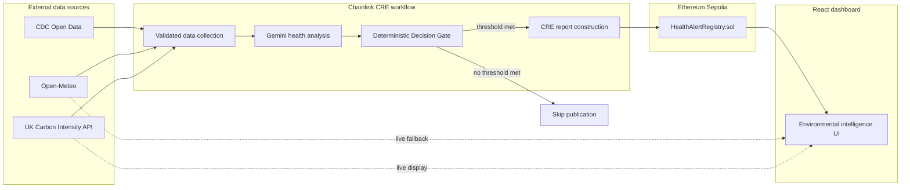
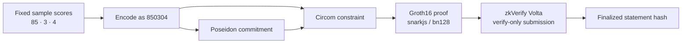
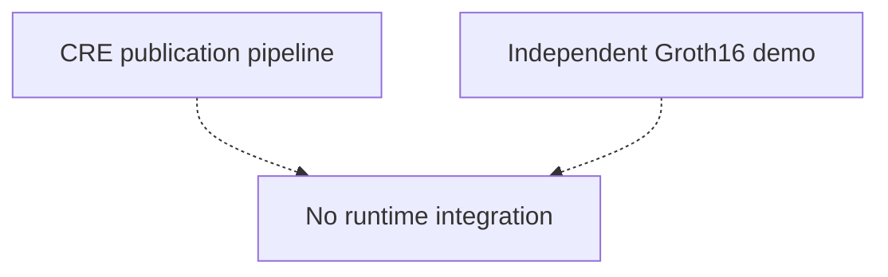
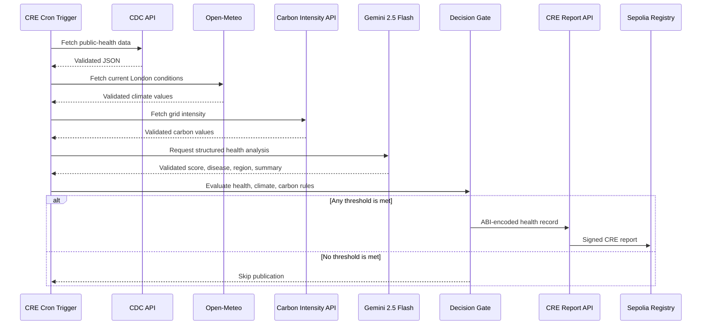

<div align="center">

# TerraGuardian

### Environmental decision intelligence with explicit trust boundaries

TerraGuardian combines public-health, climate, and electricity carbon-intensity signals in a Chainlink CRE workflow, applies deterministic publication rules, and prepares an Ethereum Sepolia report when a configured threshold is met.

The repository also includes an **independent Groth16 proof demonstration** finalized on zkVerify Volta. The proof pipeline is not currently invoked by CRE and does not gate publication.

[](contracts/HealthAlertRegistry.sol)
[](frontend/)
[](workflow-environmental-health-intelligence-agent/)
[](workflow-environmental-health-intelligence-agent/workflow.ts)
[](contracts/HealthAlertRegistry.sol)
[](zkverify/)

</div>

---

## Executive summary

Environmental monitoring systems often combine multiple trust models: external APIs, probabilistic AI output, deterministic policy, distributed workflow execution, public-chain storage, and zero-knowledge verification. TerraGuardian keeps those boundaries visible instead of presenting them as one indistinguishable “verified AI” system.

The current project demonstrates four related but deliberately separate components:

1. **Chainlink CRE workflow** — collects data, requests a Gemini health analysis, validates responses, evaluates deterministic thresholds, and prepares a signed CRE report.
2. **Ethereum Sepolia registry** — stores demonstration health, climate, and environmental-decision records.
3. **React intelligence dashboard** — reads public chain state and live environmental APIs without requiring wallet access.
4. **Independent Groth16 / zkVerify pipeline** — proves knowledge of a Poseidon preimage for a fixed sample input and submits that proof to zkVerify Volta.

> [!IMPORTANT]
> zkVerify does **not** currently verify the CRE decision, authenticate Gemini output, or authorize the Sepolia write. The submitted Groth16 proof is an independent historical demonstration.

---

## What is implemented

| Capability | Status | Current behavior |
|---|---:|---|
| CDC Open Data collection | **Implemented** | Fetches a small public-health dataset through the CRE HTTP capability. |
| Open-Meteo collection | **Implemented** | Fetches current London temperature, humidity, wind speed, and UV index. |
| UK Carbon Intensity collection | **Implemented** | Fetches current and forecast grid carbon intensity. |
| Gemini health analysis | **Implemented** | Requests a structured health-risk assessment and validates it with Zod. |
| Deterministic Decision Gate | **Implemented** | Publishes when health **OR** climate **OR** carbon risk reaches its threshold. |
| CRE report construction | **Implemented** | ABI-encodes the health record and creates an ECDSA/Keccak CRE report. |
| Sepolia report target | **Implemented** | Workflow configuration points to a deployed demonstration registry. |
| CRE workflow compilation | **Implemented** | Type-checks and compiles to CRE-compatible WASM. |
| Scheduled CRE deployment | **Prototype boundary** | Workflow code and schedule are present; continuous hosted execution is not claimed. |
| Solidity demonstration registry | **Implemented** | Stores permissionless caller-submitted records on Sepolia. |
| Read-only React dashboard | **Implemented** | Reads Sepolia through a public RPC and fetches live environmental APIs. |
| Groth16 sample proof | **Implemented** | Includes proof, public signal, and verification key artifacts. |
| zkVerify Volta submission | **Historical demo** | One independent proof submission reached finalization. |
| CRE → zkVerify orchestration | **Not implemented** | No proof is created or submitted from `workflow.ts`. |
| zkVerify-gated CRE publication | **Not implemented** | CRE does not wait for or consume a zkVerify result. |
| On-chain zkVerify receipt verification | **Future work** | No aggregation receipt or inclusion proof is verified by the registry. |

---

## Architecture

### System boundaries



The dashboard can combine the latest health record, an optional recorded climate alert, and live carbon data. These values may have different timestamps. Its Decision Gate visualization is therefore described as a **client-side policy preview**, not as a receipt for one CRE execution.

### Independent proof demonstration





There is currently no code path that transfers a CRE decision payload into `zkverify/`, invokes proof generation from the workflow, or returns a zkVerify result to the CRE report.

---

## Chainlink CRE workflow

The CRE implementation lives in [`workflow-environmental-health-intelligence-agent/workflow.ts`](workflow-environmental-health-intelligence-agent/workflow.ts).

### Execution sequence



### Decision policy

The workflow preserves AI and policy as separate concerns:

- **Gemini** produces the public-health score and summary.
- **Climate risk** is calculated deterministically from temperature and current UV index.
- **Carbon risk** is calculated deterministically from forecast intensity and the API classification.
- **Publication** uses a deterministic OR condition.

| Signal | Publication rule | Source of threshold |
|---|---|---|
| Health | `riskScore >= healthThreshold` | Workflow configuration; currently `30` |
| Climate | `climateRisk >= 3` | Shared workflow constant |
| Carbon / ESG proxy | `esgRisk >= 3` | Shared workflow constant |

The workflow validates configuration, API responses, Gemini’s outer response, and Gemini’s parsed analysis before using any value in the gate.

### CRE report contents

When the gate publishes, the report payload contains:

```text
source
region
disease
riskScore
combined summary
```

The combined summary includes the health summary plus climate and carbon context. The payload is ABI-encoded, passed to `runtime.report`, and configured with ECDSA signing and Keccak-256 hashing before `writeReport` targets the Sepolia registry.

### What CRE does not currently do

- It does not generate a Circom witness or Groth16 proof.
- It does not call zkVerify.
- It does not receive a zkVerify statement or aggregation receipt.
- It does not write a zkVerify receipt to Sepolia.
- It does not call `recordEnvironmentalDecisionAlert`; the current report shape maps to the health-alert record handled by `onReport`.

---

## What the zkVerify proof proves

The circuit is defined in [`zkverify/circuits/decision_hash.circom`](zkverify/circuits/decision_hash.circom).

It has:

- one **private input**: `decisionSecret`
- one **public input**: `decisionHash`
- one constraint: `Poseidon(decisionSecret) == decisionHash`

For the checked-in demonstration, [`zkverify/generate-input.js`](zkverify/generate-input.js) uses fixed sample values:

```text
healthRisk  = 85
climateRisk = 3
esgRisk     = 4

decisionSecret = 85 × 10,000 + 3 × 100 + 4
               = 850304
```

The Groth16 proof demonstrates that the prover knows a private value whose Poseidon hash equals the public `decisionHash`.

### Proven statement

```text
∃ decisionSecret:
Poseidon(decisionSecret) = public decisionHash
```

### Not proven

The current circuit does **not** prove:

- that `decisionSecret` was produced by the CRE workflow;
- that the encoded fields are valid health, climate, or carbon scores;
- that any publication threshold was met;
- that the OR policy was evaluated correctly;
- that CDC, Open-Meteo, Carbon Intensity API, or Gemini produced the values;
- that Gemini’s assessment is factually correct;
- that the latest Sepolia alert corresponds to this proof;
- that a zkVerify result was consumed on Ethereum.

This is best understood as a **Groth16 and zkVerify transport demonstration**, not a proof of the complete TerraGuardian decision policy.

### Historical Volta result

| Field | Value |
|---|---|
| Network | zkVerify Volta Testnet |
| Proof system | Groth16 |
| Proving library | snarkjs |
| Curve | bn128 |
| Submission mode | Verify-only; no aggregation domain configured |
| Status | Historical transaction finalized |
| Transaction hash | `0x942a124065c32cf758be3c90caaf562545e7b58cee1bba950e4a909747029a2f` |
| Statement hash | `0xcb17b4b45cc94c05670e0f43c691143fce6f391d88adf7802bd28e2bf1baede5` |

The React dashboard labels this result **Historical zkVerify demo** and explicitly states that it was completed independently.

---

## Ethereum demonstration registry

[`contracts/HealthAlertRegistry.sol`](contracts/HealthAlertRegistry.sol) is an append-only demonstration contract with three record shapes.

| Record | Current role | Workflow integration |
|---|---|---|
| `HealthAlert` | Public-health record displayed by the dashboard | **Used by the current CRE report shape** |
| `ClimateAlert` | Optional manually or externally submitted climate record | Not written by the current CRE workflow |
| `EnvironmentalDecisionAlert` | Reserved combined-decision record with a proof-reference field | Future integration boundary |

### Contract trust model

The registry intentionally has **no access control** for this hackathon demonstration.

- `recordAlert`, `recordClimateAlert`, `recordEnvironmentalDecisionAlert`, and `onReport` are permissionless.
- `publisher` means the immediate `msg.sender`; it does not authenticate an oracle, CRE workflow, or data provider.
- `evidenceHash` is caller-supplied metadata.
- `proofHash` is a caller-supplied proof reference and is not verified by the contract.
- `block.timestamp` records the inclusion block’s timestamp, not the original observation time.

Accordingly, contract storage provides public persistence and event visibility, but the current contract does not enforce publisher provenance or zkVerify-backed authorization.

---

## Frontend

The React dashboard presents the system as an environmental-intelligence interface while keeping provenance visible.

### Data channels

| Dashboard data | Source | Wallet required |
|---|---|---:|
| Latest health alert | Sepolia registry through public JSON-RPC | No |
| Latest recorded climate alert | Sepolia registry when present | No |
| Live climate fallback | Open-Meteo | No |
| Carbon intensity | UK Carbon Intensity API | No |
| Historical proof metadata | Checked-in zkVerify demonstration record | No |

Read and write concerns are separated:

- `blockchainRead.js` uses a read-only `JsonRpcProvider`.
- `blockchainWrite.js` requests a browser-wallet signer only for an explicit write operation.

Shared decision calculations live under `frontend/src/domain/`, and dashboard loading/error orchestration lives under `frontend/src/hooks/`.

### Interface modules

- Public-health risk gauge, data completeness, declared provenance, and workflow timeline
- London temperature, humidity, current UV, wind, and climate-risk visualization
- Institutional carbon-intensity monitor with actual/forecast comparison
- Central three-input Decision Gate preview
- Historical zkVerify proof card with explicit non-integration language
- Parallel CRE and Groth16 architecture visualization

---

## Repository structure

```text
environmental-health-intelligence-agent/
├── contracts/
│   └── HealthAlertRegistry.sol
│
├── docs/
│   └── zkverify-integration-notes.md
│
├── frontend/
│   ├── public/
│   └── src/
│       ├── assets/                  Generated hero and SVG illustrations
│       ├── components/              Dashboard presentation components
│       ├── domain/
│       │   └── decision.js          Shared frontend decision policy
│       ├── hooks/
│       │   └── useDashboardData.js  Loading, error, and refresh orchestration
│       ├── services/
│       │   ├── blockchainConfig.js
│       │   ├── blockchainRead.js
│       │   ├── blockchainWrite.js
│       │   ├── climate.js
│       │   ├── esg.js
│       │   ├── registryAbi.js
│       │   ├── validation.js
│       │   └── zkverify.js
│       ├── App.jsx
│       └── index.css
│
├── workflow-environmental-health-intelligence-agent/
│   ├── config/
│   │   ├── config.staging.json
│   │   └── config.production.json
│   ├── main.ts
│   ├── workflow.ts
│   └── workflow.yaml
│
├── zkverify/
│   ├── build/
│   │   ├── proof.json
│   │   ├── public.json
│   │   └── verification_key.json
│   ├── circuits/
│   │   └── decision_hash.circom
│   ├── generate-input.js
│   ├── input.json
│   ├── submit-proof.js
│   └── verification-summary.json
│
├── project.yaml
└── secrets.yaml                     CRE secret-name mapping; no secret values
```

Generated Remix artifacts and local build output are implementation support files rather than additional application layers.

---

## Run locally

### Requirements

- Node.js and npm
- CRE-compatible workflow toolchain for workflow compilation or simulation
- A Gemini API key mapped through the CRE secrets configuration
- A zkVerify Volta-funded test account only if repeating proof submission

### React dashboard

```bash
cd frontend
npm install
npm run dev
```

Optional frontend configuration:

```bash
VITE_SEPOLIA_RPC_URL=
VITE_HEALTH_ALERT_REGISTRY_ADDRESS=
```

If unset, the dashboard uses the checked-in Sepolia address and public RPC defaults.

### Frontend validation

```bash
cd frontend
npm run lint
npm run build
```

### CRE workflow validation

```bash
cd workflow-environmental-health-intelligence-agent
npm install
npx tsc --noEmit
```

The workflow configuration expects the `GEMINI_API_KEY` secret name mapped in `secrets.yaml`. Secret values are supplied through the CRE environment and are not committed.

### Independent zkVerify demo

```bash
cd zkverify
npm install
node generate-input.js
```

Proof submission uses:

```bash
node submit-proof.js
```

`submit-proof.js` expects valid Groth16 artifacts in `zkverify/build/` and a local `SEED_PHRASE`. Never commit the seed phrase or production credentials.

> [!NOTE]
> `generate-input.js` regenerates the sample circuit input. It does not automatically regenerate all witness, proving-key, and proof artifacts.

---

## Verification and build status

The following checks pass in the current repository state:

| Check | Result |
|---|---:|
| Frontend ESLint | Pass |
| Frontend production build | Pass |
| Workflow TypeScript type-check | Pass |
| CRE workflow → WASM compilation | Pass |
| Solidity 0.8.20 compilation | Pass |
| Desktop browser runtime check | Pass |
| 390px responsive layout check | Pass |

These build checks demonstrate repository consistency. They are not claims about continuous hosted CRE operation, production security, or medical validity.

---

## Roadmap

### Phase 1 — Canonical decision package

- Define one versioned serialization for health, climate, carbon, thresholds, timestamps, and source commitments.
- Produce that package once per CRE execution.
- Store an application commitment alongside the published record.
- Add deterministic fixtures covering all threshold boundaries.

### Phase 2 — Policy-constrained proof

- Replace the sample preimage circuit with explicit field constraints.
- Range-constrain each risk score.
- Enforce the same OR publication rule used by CRE.
- Bind public inputs to a canonical decision commitment.
- Add reproducible witness, setup, proof, and local verification scripts.

### Phase 3 — zkVerify receipt integration

- Submit the policy proof through an authenticated orchestration path.
- Use an aggregation domain where required for receipt generation.
- Retrieve and validate the relevant statement and inclusion data.
- Link the proof result to the exact CRE decision package.

### Phase 4 — Authenticated on-chain consumption

- Introduce an authorized CRE receiver or equivalent publisher boundary.
- Verify the zkVerify receipt or accepted cross-chain representation on the destination chain.
- Gate the combined environmental-decision write on the verified statement.
- Add replay protection, versioning, and operational monitoring.

### Phase 5 — Production hardening

- Threat modeling and independent contract review
- Resilient data-source aggregation and failure policy
- Model/version provenance and prompt versioning
- Pagination and storage-cost controls
- Accessibility, observability, and incident response

---

## Security and scope

TerraGuardian is a **hackathon and portfolio demonstration**.

It is not:

- a medical diagnosis or public-health authority;
- a comprehensive ESG rating system;
- a production oracle network deployment;
- a permissioned or provenance-enforcing registry;
- a proof that an AI model is truthful;
- a production-ready zero-knowledge authorization system.

Its purpose is to demonstrate clean architectural boundaries between external data, AI-assisted analysis, deterministic policy, CRE report publication, public-chain storage, dashboard presentation, and an independently operated zero-knowledge proof pipeline.

---

<div align="center">

**TerraGuardian** — observe broadly, decide deterministically, verify precisely.

</div>
